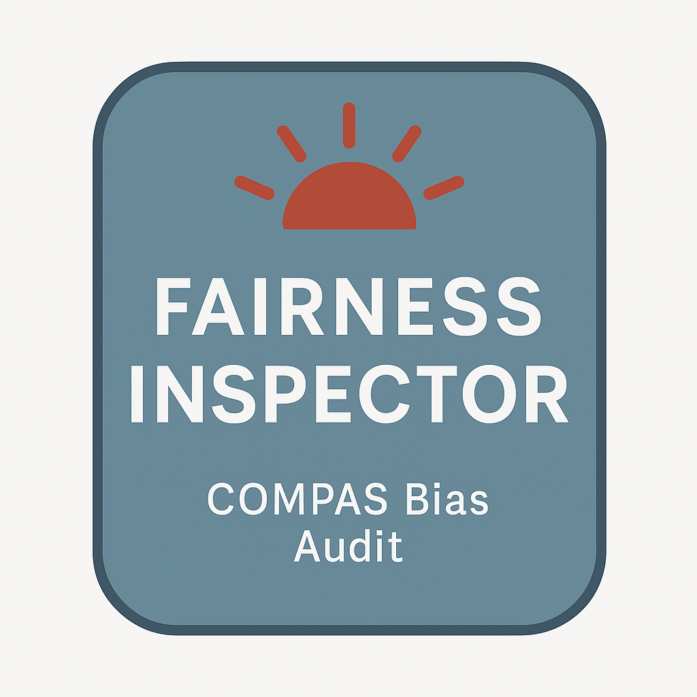
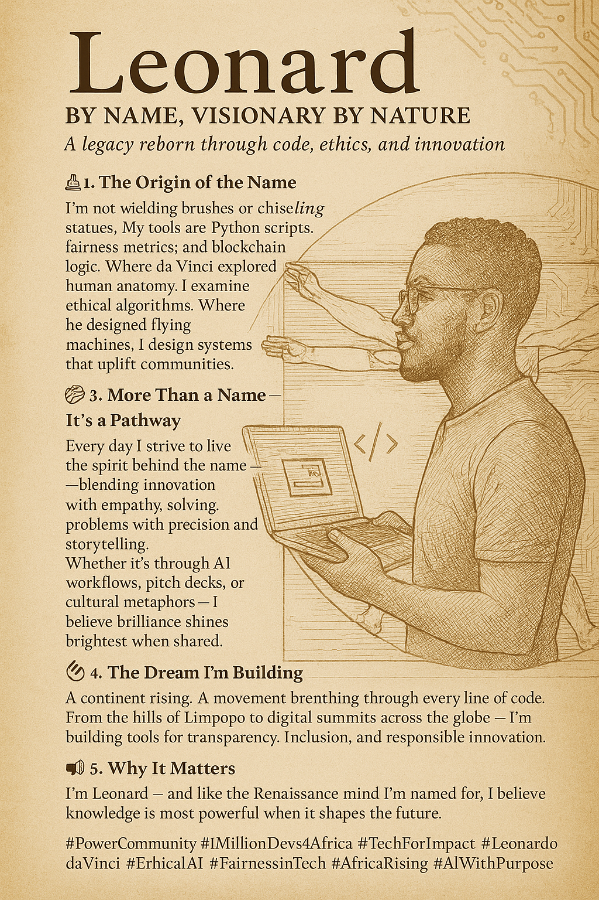
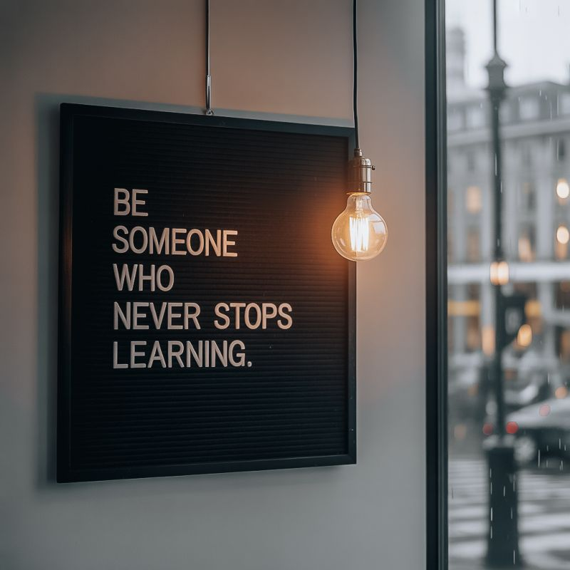
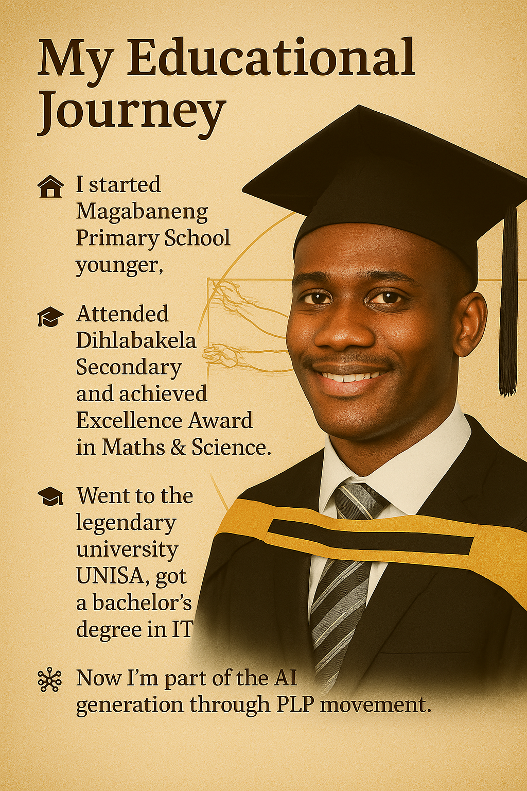

<<<<<<< HEAD
<<<<<<< HEAD
# 🕵️‍♂️ Responsible AI Inspector

A short case study collection investigating how artificial intelligence systems can go wrong — and how we can design them better. Created as part of a Responsible AI assignment for the PLP program, this repo showcases ethics in action through two fictional scenarios.

## 🔍 Case Files

### 1️⃣ The Hiring Bot with Hidden Bias
- 📌 AI rejects candidates with career gaps — especially women.
- ⚠️ Bias from historical data, no transparency, zero accountability.
- ✅ Fix: Add fairness constraints + human review in edge cases.

### 2️⃣ The School Proctoring AI with Tunnel Vision
- 📌 Flags cheating based on eye movement in remote exams.
- ⚠️ Neurodivergent students penalized unfairly.
- ✅ Fix: Add accommodations + human-in-the-loop oversight.

## ✍️ Blog-Style Narratives
Each case is written like a mini blog post — accessible, thoughtful, and inspector-themed. Full write-up in `CASE_NOTES.md`.

## 👤 Author
**Leonard Phokane**  
Ethical AI Advocate | Creative Technologist  
🔗 [GitHub Portfolio](https://github.com/leonardphokane)  
🌐 [Portfolio Site](https://phokane-creative-code.lovable.app/)

## ✨ Use This Format
Got your own AI ethics story? Fork this repo and submit your case — let's make bias visible and accountability non-negotiable.
=======
# leonard-bio-legacy
>>>>>>> de9b46e34f9ce7719e00934bb861b6a185549292
=======
# 👨🏾‍💻 Legacy in Code: The Leonard Phokane Story

Named after da Vinci. Built in Limpopo. Rising with Purpose.

### ⚖️ Fairness & Community Highlights

<table>
  <tr>
    <td align="center">
       
      <strong>Fairness Inspector — COMPAS Audit</strong>
    </td>
    <td align="center">
       
      <strong>PLPCommunity Post</strong>
    </td>
  </tr>
</table>

Welcome to the digital archive of my journey — where code meets culture, and legacy is written line by line.  
From Magabaneng to PLP, I’ve woven ethical AI, fairness audits, and storytelling into every byte.  
This repo reflects the heartbeat of my impact: projects, insights, metaphors, and milestones.

## 📁 Contents
- [`TIMELINE.md`](./TIMELINE.md) – My educational and career journey  
- [`PROJECTS.md`](./PROJECTS.md) – Signature work & impact  
- [`ACHIEVEMENTS.md`](./ACHIEVEMENTS.md) – Verified milestones  
- [`QUOTES.md`](./QUOTES.md) – Reflections & metaphors  
- [`MEDIA/`](./MEDIA) – Visual artifacts  
- [`padlet-links.md`](./padlet-links.md) – PLPCommunity posts

### 🧠 Leonard: By Name, Visionary By Nature

- **Title**: Leonard: By Name, Visionary By Nature  
- **Theme**: Identity, Renaissance Inspiration  
- **Origin**: Branding Profile Card  
- **Message**: Channeling da Vinci’s spirit through ethical systems, storytelling, and fair innovation

## 🛡️ Badges
  
  
  
  
  

🚀 From PLP learner to Fairness Inspector.

I just published my legacy archive — a living repo of impact, storytelling, and ethical systems, built line by line.

This biography isn’t static — it’s version-controlled. 🌍✨
## 🎞️ Motivational Archive

### 🖼️ Edison’s Gospel of Growth

- **Title**: Edison’s Gospel of Growth  
- **Theme**: Lifelong Learning, Innovation  
- **Origin**: Lightboard Quote Scene  
- **Message**: Pursue knowledge relentlessly, even when the wiring sparks failure

🔗 Explore the archive: leonardphokane.github.io/leonard-bio-legacy

🤝 Connect with Leonard Phokane
» 🗨️ Discord: leonardphokane » 💻 GitHub: github.com/leonardphokane

Let’s build tech that reflects our stories and scales our impact.

🔖 Hashtags
#1MillionDevs4Africa #PowerLearnProject #PowerCommunity #LegacyInCode #FairnessByDesign

### 🎓 Legacy Gallery

**Legacy Banner**  

**Graduation Day**  

**PLPCommunity Post**  
📸 Title: PLPCommunity Post  
📝 Caption: “I build systems that speak our languages and solve our problems.”  
🎨 Style: Da Vinci parchment meets Pan-African tech — warm tones, bold quote overlay, subtle circuit patterns  
📁 Suggested Filename: `plpcommunity-post.png`

## 🔥 Mission Statement
To build inclusive systems, amplify voices through code, and make tech a mirror of justice.

## 💼 Portfolio
Explore my creative tech archive:  
[phokane-creative-code.lovable.app](https://phokane-creative-code.lovable.app)

>>>>>>> 032f4895575006fe55ce4c9d97169ea81d44abec
